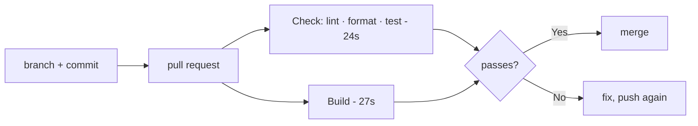

```mermaid
flowchart LR
  B[branch + commit] --> PR[pull request]
  PR --> Q[Check: lint · format · test - 24s]
  PR --> BU[Build - 27s]
  Q --> S{passes?}
  BU --> S
  S -->|Yes| M[merge]
  S -->|No| F[fix, push again]
```
